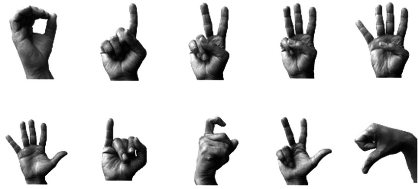
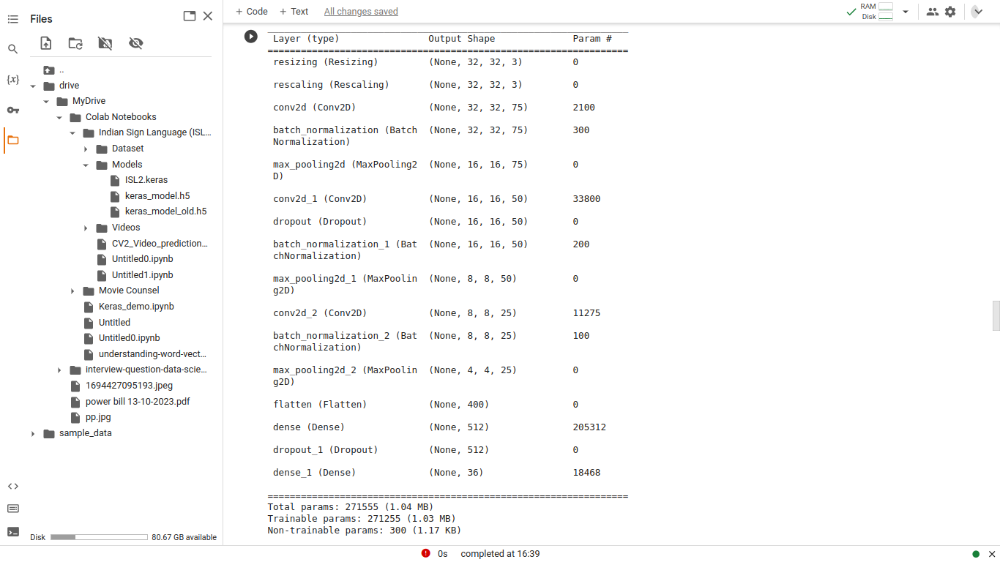

# ISL Detection - An Indian ☝ Sign 👋 Language 🖐️ Symbol Detection app.
[](https://isl-detection.streamlit.app)
[](https://www.linkedin.com/in/shailesh-bisht-b42a73184/)
[](https://streamlit.io/)
[]()
[]()
[]()
[]()
<br>

# Objective
The objective of this web app is to develop a real-time Indian Sign Language (ISL) symbol
detection system. Its primary aim is to facilitate seamless communication between 
hearing-impaired individuals and the general population. Many people are not familiar 
with sign language, which can create communication barriers. To address this, we are 
initially focusing on detecting basic hand signs related to alphabets and digits. Our 
goal is to ensure that hearing-impaired individuals can be better understood by others, 
enhancing their overall communication experience.


# Indian 🖐️ Sign 🤲 Language (ISL) History
<details>
    <summary></summary>
    In the 2000s, the Indian deaf community advocated for an institute dedicated to Indian 
        Sign Language (ISL) teaching and research. Their efforts culminated in the approval of 
        the Indian Sign Language Research and Training Center (ISLRTC) under the Indira Gandhi 
        National Open University (IGNOU), Delhi, in 2011. However, the center at IGNOU closed 
        in 2013, sparking protests. Following discussions and protests, ISLRTC was integrated
          with the Ali Yavar Jung National Institute of Hearing Handicapped (AYJNIHH) in 2015. 
          After further negotiations, ISLRTC was officially established as a Society under the 
          Department of Empowerment of Persons with Disabilities, Ministry of Social Justice
        and Empowerment, in New Delhi on September 28, 2015. This achievement significantly
        addressed gaps in the education and communication needs of India's deaf community.
</details>

# About the App
#### This Web App provides:
- Real-time hand sign detection based on the Indian Sign Language (ISL).
- Aids those unfamiliar with ISL in understanding hearing-impaired individuals.
- Multiple detection options: real-time detection with live camera feed, image uploads, and video analysis.
- Identificaton of specific signs present in the input, whether it's an image, video, or live camera feed.
- Initial release includes digit (0-9) detection; alphabet detection is planned for a future update.


# ISL Representation
<details>
    <summary></summary>

- ISL has its own distinct vocabulary and grammar system. It is not directly based on spoken languages like Hindi or English but has its own
    syntax and grammar rules. 
- ISL relies on various handshapes and movements to convey meaning. Different handshapes and movements can represent different words, ideas, or
concepts.
## Hand Signs for Digits 0-9
<br>

<br>

## Hand Signs for Alphbet A-Z
<br>

</details>

# Data Analysis
<details>
    <summary></summary>

#### i). Source Data
- Created Custom Data of Hand signs using Google's [Teachable Machines](https://teachablemachine.withgoogle.com/train) along with [Kaggle's ISL Dataset](https://www.kaggle.com/datasets/prathumarikeri/indian-sign-language-isl/data)

#### ii). Preprocessing
- **Data Augmentation** - a technique to increase the diversity of your training set by applying random (but realistic) transformations, such as image rotation.

- Applied data augmentation techniques to enhance training dataset diversity using Keras' ImageDataGenerator. Techniques included random horizontal rotation, flipping, brightness and contrast adjustments, resizing, resampling, and more.

- Developed a custom dataset utilizing Google Teachable Machine, further contributing to the dataset's richness and authenticity.

- Please refer to this **[notebook](https://colab.research.google.com/drive/1w6l66LP_64kAyPYr55McLQwcjCvdrlEo#scrollTo=6MB5xTQeSLOP)** for complete detailed analysis, also check out other files in this **[📁](https://drive.google.com/drive/u/0/folders/1REEotHVi5nWUc2GXjauM6MUBULE7TL_d)**,all these are part of the Data Pre-processing and Data Cleaning.

#### iii). CNN Architecture
- created a **Convolutional Nueral Network** (CNN) Model with below architecture


- Leveraged Google's **Teachable Machine** to develop a more intricate neural network, which significantly improved model performance.

- Applied Keras' **ImageDataGenerator**, a powerful tool for augmenting the training dataset. This included techniques such as random horizontal rotation, flipping, adjustments in brightness, contrast, resizing, resampling, and more, resulting in a more diverse and authentic dataset.

- Incorporated **Mediapipe**'s Hands solutions to accurately identify and display hand landmarks within images. Subsequently, the hand regions were cropped from the images and fed into the CNN model for precise predictions.
</details>

## Web Frontend
- Streamlit is used for building the web app and Stremlit Cloud is used for hosting the web app.

## Installation
To set up and use Sentiment Analyzer in your own project, follow these steps:

- Clone this repository to your local machine.
```
    git clone https://github.com/peskyji/ISL-Hand-Sign-Recognition.git
```
- Install the required dependencies for python 3.9 or above.
```
    pip install -r requirements.txt
```
- Run the streamlit application
```
streamlit run home.py
```
